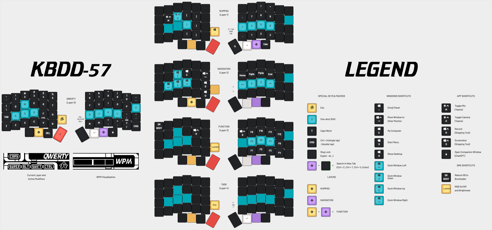

# KBDD-57


## Design
* Based on the [Lily58 Pro by kata0510](https://github.com/kata0510/Lily58)
* Keyboard PCB: [Lily58 DIY PDB - Solderable Split Keyboard PCB](https://boardsource.xyz/products/lily58-solderable-pcb) from Boardsource
* Case: [Lily58 DIY Keyboard Kit - 60% Split](https://boardsource.xyz/products/lily58) from Boardsource
* Microcontrollers: [Blok RP2040 Controller](https://boardsource.xyz/products/blok-rp2040-controller-for-the-keyboards) from Boardsource
* OLEDs: [OLED-S Screen](https://boardsource.xyz/products/oled-s-screen) (SSD1306 128x32) from Boardsource
* Rotary Encoder: CYT1100 ([Buy on Amazon](https://www.amazon.com/dp/B07DM2YMT4))
* Tenting Feet ([Buy on Amazon](https://www.amazon.com/dp/B0BLV5HVSH))

## Switches and Keycaps
* [Gateron Milky Yellow Pro V2](https://www.gateron.co/products/gateron-ks-3x1-full-milky-switch-set?variant=40069272141913) ([Buy on Amazon](https://www.amazon.com/dp/B0C2CWR4HH))
* [Drop MT3 White-on-Black Keycap Set (Ortho Kit)](https://drop.com/buy/drop-mt3-white-on-black-keycap-set)
* [Drop + Mito Pulse MT3 Keycap Set (Extras Kit)](https://drop.com/buy/drop-mito-mt3-pulse-keycap-set)
* [Drop + Matt3o /dev/tty MT3 Custom Keycap Set R3 (RGB)](https://drop.com/buy/drop-matt3o-devtty-custom-keycap-set)

## Keymap


### Key Features
* [Home Row Mods](https://precondition.github.io/home-row-mods)
* [One-shot Shift](https://docs.qmk.fm/one_shot_keys#one-shot-keys)
* [Caps Word](https://docs.qmk.fm/features/caps_word#caps-word)
* [RGB Matrix](https://docs.qmk.fm/features/rgb_matrix#rgb-matrix-lighting) Lighting
  * Encoder spin indicators using [`dmyoung9/encoder_ledmap`](https://github.com/dmyoung9/qmk_modules)
  * Special keys highlighted using [`elpkenenin/indicators`](https://github.com/elpekenin/qmk_modules)
  * Idle fadeout and brightness control using [`getreuer/lumino`](https://github.com/getreuer/qmk-modules)
  * Typing heatmap effect
* Bluetooth Toggle
  * Since there is not a native keyboard shortcut on Windows for toggling Bluetooth on and off, this "macro" seamlessly opens the connections menu, toggles Bluetooth, and then closes the menu, in a single keystroke
* "Task Layer"
  * Launches Task View (`Win + Tab`) with intuitive encoder navigation
  * Automatically exits on selection (`Enter`), cancel (`Esc`), or timeout (`3s`)
* Custom [LCARS](https://en.wikipedia.org/wiki/LCARS)-themed OLED design
  * Layer and modifier transitions on master
  * WPM visualization (current and moving average) on slave (using [`dmyoung9/wpm_stats`](https://github.com/dmyoung9/qmk_modules))

---

# QMK Userspace

This is a template repository which allows for an external set of QMK keymaps to be defined and compiled. This is useful for users who want to maintain their own keymaps without having to fork the main QMK repository.

## Howto configure your build targets

1. Run the normal `qmk setup` procedure if you haven't already done so -- see [QMK Docs](https://docs.qmk.fm/#/newbs) for details.
1. Fork this repository
1. Clone your fork to your local machine
1. Enable userspace in QMK config using `qmk config user.overlay_dir="$(realpath qmk_userspace)"`
1. Add a new keymap for your board using `qmk new-keymap`
    * This will create a new keymap in the `keyboards` directory, in the same location that would normally be used in the main QMK repository. For example, if you wanted to add a keymap for the Planck, it will be created in `keyboards/planck/keymaps/<your keymap name>`
    * You can also create a new keymap using `qmk new-keymap -kb <your_keyboard> -km <your_keymap>`
    * Alternatively, add your keymap manually by placing it in the location specified above.
    * `layouts/<layout name>/<your keymap name>/keymap.*` is also supported if you prefer the layout system
1. Add your keymap(s) to the build by running `qmk userspace-add -kb <your_keyboard> -km <your_keymap>`
    * This will automatically update your `qmk.json` file
    * Corresponding `qmk userspace-remove -kb <your_keyboard> -km <your_keymap>` will delete it
    * Listing the build targets can be done with `qmk userspace-list`
1. Commit your changes

## Howto build with GitHub

1. In the GitHub Actions tab, enable workflows
1. Push your changes above to your forked GitHub repository
1. Look at the GitHub Actions for a new actions run
1. Wait for the actions run to complete
1. Inspect the Releases tab on your repository for the latest firmware build

## Howto build locally

1. Run the normal `qmk setup` procedure if you haven't already done so -- see [QMK Docs](https://docs.qmk.fm/#/newbs) for details.
1. Fork this repository
1. Clone your fork to your local machine
1. `cd` into this repository's clone directory
1. Set global userspace path: `qmk config user.overlay_dir="$(realpath .)"` -- you MUST be located in the cloned userspace location for this to work correctly
    * This will be automatically detected if you've `cd`ed into your userspace repository, but the above makes your userspace available regardless of your shell location.
1. Compile normally: `qmk compile -kb your_keyboard -km your_keymap` or `make your_keyboard:your_keymap`

Alternatively, if you configured your build targets above, you can use `qmk userspace-compile` to build all of your userspace targets at once.

## Extra info

If you wish to point GitHub actions to a different repository, a different branch, or even a different keymap name, you can modify `.github/workflows/build_binaries.yml` to suit your needs.

To override the `build` job, you can change the following parameters to use a different QMK repository or branch:
```
    with:
      qmk_repo: qmk/qmk_firmware
      qmk_ref: master
```

If you wish to manually manage `qmk_firmware` using git within the userspace repository, you can add `qmk_firmware` as a submodule in the userspace directory instead. GitHub Actions will automatically use the submodule at the pinned revision if it exists, otherwise it will use the default latest revision of `qmk_firmware` from the main repository.

This can also be used to control which fork is used, though only upstream `qmk_firmware` will have support for external userspace until other manufacturers update their forks.

1. (First time only) `git submodule add https://github.com/qmk/qmk_firmware.git`
1. (To update) `git submodule update --init --recursive`
1. Commit your changes to your userspace repository
